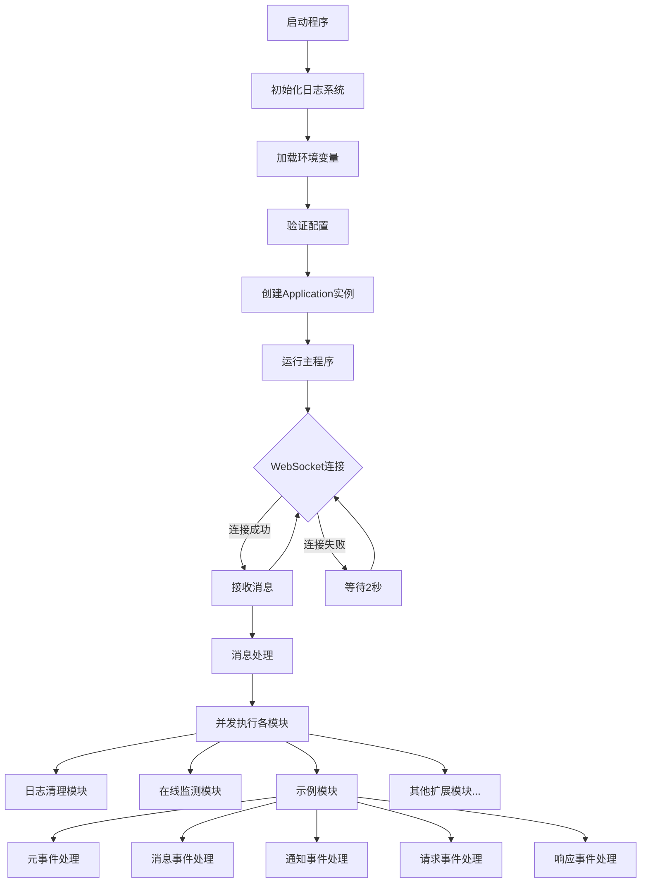
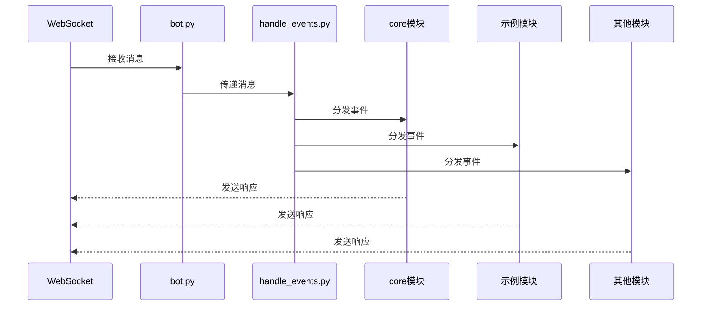
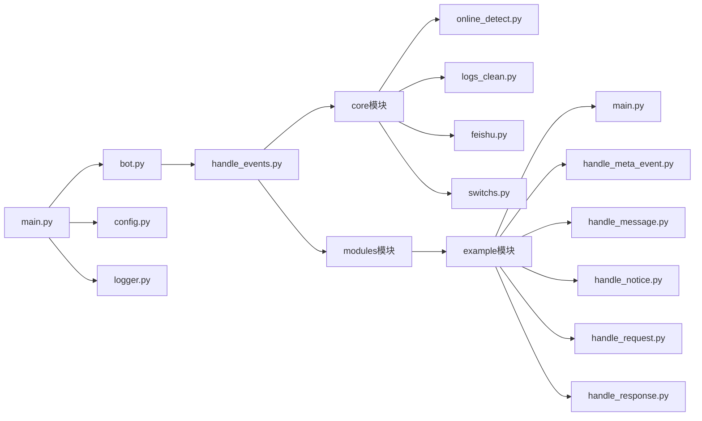

Hi👋🏻，我是卷卷，一个QQ机器人，W1ndys是我的开发者

# W1ndysBotFrame 流程图

## 整体架构流程图

```mermaid
graph TD
    A[启动程序] --> B[初始化日志系统]
    B --> C[加载环境变量]
    C --> D[验证配置]
    D --> E[创建Application实例]
    E --> F[运行主程序]
    
    F --> G{WebSocket连接}
    G -->|连接成功| H[接收消息]
    G -->|连接失败| I[等待2秒]
    I --> G
    
    H --> J[消息处理]
    J --> K[并发执行各模块]
    
    K --> L1[日志清理模块]
    K --> L2[在线监测模块]
    K --> L3[示例模块]
    K --> L4[其他扩展模块...]
    
    L3 --> M1[元事件处理]
    L3 --> M2[消息事件处理]
    L3 --> M3[通知事件处理]
    L3 --> M4[请求事件处理]
    L3 --> M5[响应事件处理]
    
    H --> G
```

## 消息处理流程图

```mermaid
sequenceDiagram
    WebSocket ->> bot.py: 接收消息
    bot.py ->> handle_events.py: 传递消息
    handle_events.py ->> core模块: 分发事件
    handle_events.py ->> 示例模块: 分发事件
    handle_events.py ->> 其他模块: 分发事件
    
    core模块 -->> WebSocket: 发送响应
    示例模块 -->> WebSocket: 发送响应
    其他模块 -->> WebSocket: 发送响应
```

## 模块结构图

```mermaid
graph LR
    A[main.py] --> B[bot.py]
    B --> C[handle_events.py]
    
    C --> D[core模块]
    D --> D1[online_detect.py]
    D --> D2[logs_clean.py]
    D --> D3[feishu.py]
    D --> D4[switchs.py]
    
    C --> E[modules模块]
    E --> E1[example模块]
    E1 --> E1-1[main.py]
    E1 --> E1-2[handle_meta_event.py]
    E1 --> E1-3[handle_message.py]
    E1 --> E1-4[handle_notice.py]
    E1 --> E1-5[handle_request.py]
    E1 --> E1-6[handle_response.py]
    
    A --> F[config.py]
    A --> G[logger.py]
```
